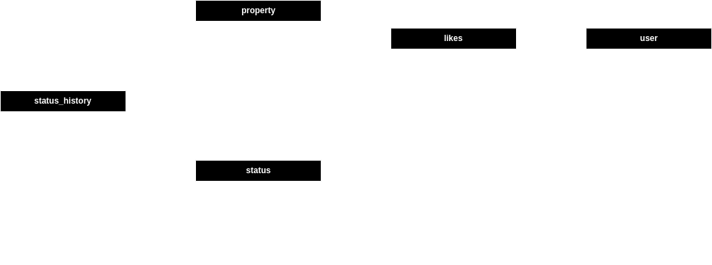

#  Solucion prueba técnica para desarrollador Backend

Esta prueba consiste en dos microservicios, uno de consulta de propiedades y uno de "me gusta". Para el primero se proporciona el codigo para un microservicio funcional, y para el segúndo únicamente el diseño.

Requerimientos para el servicio de consulta:
- Los usuarios pueden consultar los inmuebles con los estados "pre_venta", "en_venta", y "vendido".
- Los usuarios pueden filtrar estos inmuebles por: Año de construcción, Ciudad, Estado.
- Los usuarios pueden aplicar varios filtros en la misma consulta.
- Los usuarios pueden ver la siguiente información del inmueble: Dirección, Ciudad, Estado, Precio de Venta, y Descripción.

> Para el servicio de consulta fueron proveidos los datos de conexión a una base de datos existente.

Para el servicio de "Me Gusta":
- Los usuarios pueden darle me gusta a un inmueble en específico y esto debe quedar registrado en la base de datos.
- Los "Me Gusta" son de usuarios registrados, y debe quedar registrado en la base de datos el histórico de "me gusta" de cada usuario y a cuáles inmuebles.

> El servicio de "Me Gusta" es conceptual, no existe el modelo de la base de datos para soportarlo así que en lugar de una impleentación se entrega un diseño.

## Tecnologías Usadas en el Servicio de Consulta

Para el desarrollo del microservicio de consulta, ante la restricción de utilizar un web framework se opta por desarrollar una aplicación serverless en AWS utilizando serverless framework como herramienta de infraestructura como código. El lenguage de programación utlizado en la función lambda es Python. Adicionalmete se usa `pymysql` para la conexión a la base de datos.

La arquitectura del servicio consta únicamente de la fución lambda configurada para ser invocada desde una url, los detalles de conexión a la base de datos son cargados como variables de entorno. Esto es suficiente para una prueba de concepto, sin embargo para una arquitectura más completa, robusta, y segura se podría intregrar la función lambda con API Gateway y Secrets Manager, además de la posibilidad de agregar la base de datos al servicio como parte del stack de Cloud Formation generado.

Para las pruebas unitarias, se utiliza `pytest` con `pytest_mock` y se crea una base de datos temporal en tiempo de ejecución de las pruebas en `sqlite3`.

Para la calidad del codigo se utiliza `pre-commit` incluyendo hooks como `isort`, `autopep`, y `black`. Además, el codigo se elaboró cuidadosamente incluyendo type hints, docstring y una organización modular teniendo en cuenta el principio de separación de responsabilidades.

## Diseño Servicio de Me Gusta

El diseño más sencillo para soportar esta característica incluye la creación de dos nuevas tablas:
- user
- likes

La primera tabla de usuarios sirve como base para el sistema de autenticación de la aplicación y la tabla likes modela la relación muchos a muchos entre property y likes.



Como propuesta de optimización para consultar propiedades ordenadas por número de likes, se puede crear un campo adicional en la tabla property like_count que lleve registro del número total de like y sobre el que se cree a su vez un índice para optimizar las consultas.

Sin embargo, esto agrega la complejidad adicional de tener que mantenerlo actualizado siempre que se inserte o se elimine un registro en la tabla likes, esto se puede implementar en la lógica de la aplicación o como un trigger en la base de datos.

### Creación de las tablas propuestas

A continuación se presentan las sentencias `CREATE TABLE`
Para crear la tabla user:

```sql
CREATE TABLE `user` (
    `id` INT(11) NOT NULL AUTO_INCREMENT,
    `username`  VARCHAR(32) NOT NULL,
    `password` CHAR(60) NOT NULL,
    PRIMARY KEY (`id`),
    UNIQUE (`username`)
)
```

Para la taba likes:
```sql
CREATE TABLE `likes` (
    `id` INT NOT NULL AUTO_INCREMENT,
    `property_id` INT(11) NOT NULL,
    `user_id` INT(11) NOT NULL,
    PRIMARY KEY (`id`),
    CONSTRAINT `property_id` FOREIGN KEY REFERENCES `property`(`id`),
    CONSTRAINT `user_id` FOREIGN KEY REFERENCES `user`(`id`),
)
```
